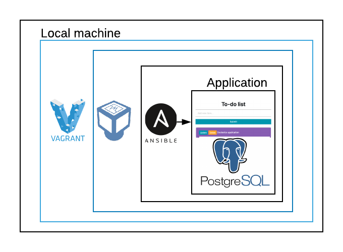
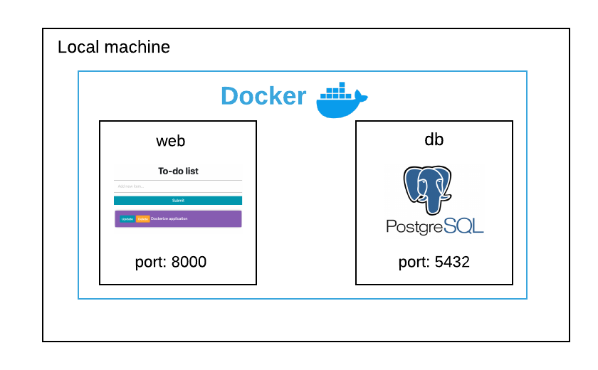

# To-do list
This project will resemble a to-do list where you can track all of the tasks that you need to complete, the user will be
able to create, update and delete tasks in the list. 

This basic application is written in Python, it uses Django web framework and Postgres as the database. 

## Django
Django runs on an Model View Template system:

**Model**: Sets out the schema for our database. With Django’s ORM, you can declare the fields, field types, etc. 

**View**: Set all of your code logic and algorithms, you can get results from the database or manipulate some data, it basically 
expects a request and a response. 

**Template**: Plain HTML code with Django's Template Language in it.

**Settings**: Holds all the settings of your web app.

**Url**: It helps to connect the view to a url.

**Admin**: Deals with how you want to view your models in the django admin.

## Setup local environment 

Install postgress
Install requirements 

## CI/CD
**GitHub Actions** is a continuous integration that makes it easy to automate all your software workflows. 
It builds, test and deploys code right from GitHub.

> NOTE: I had used Travis CI but after a few issues with the provisioning of builds out of knowhere
> I decided to change to GitHub Actions

**Heroku** is a cloud platform that lets you build, deliver, monitor and scale applications. For this app, Heroku
was configure to deploy the application after a merge to master from a PR. 

For this project, the workflows are described in [.github/workflows](.github/workflows), there are two different types:
* Run unit tests: will only run on Pull Requests and when a merge to master happens
* Deploy to Heroku: will only run when there's a merge to master 


Useful commands: 
* `heroku run bash -a todolist-dsti-devops` 
* `psql $DATABASE_URL`

## Infrastructure as Code
**Vagrant** is a tool for building and maintaining portable virtual software development environments, it 
also has integration with **Ansible** as a provisioner for these virtual machines. 

To run the application make sure you have Virtualbox and Vagrant already installed and `cd` into the root directory
of the project: 
```
$ vagrant up
```
Wait for it to provision and the app will be running on: http://20.20.20.2:8000/ and http://localhost:8080/
this is because we have the following lines in the [Vagrantfile](Vagrantfile): 
```
server.vm.network :private_network, ip: "20.20.20.2"
server.vm.network "forwarded_port", guest: 8000, host: 8080, host_ip: "127.0.0.1"
```
* **private_network** allows to access the guest machine with a private address **20.20.20.2:8080**
* **forwarded_port** will allow accessing port **8000** on the guest via port **8080** on the host.

For the cleanup run: 
```
$ vagrant destroy
```

## Dockerizing the application

* [Dockerfile](Dockerfile) builds an image based on a Python image on Docker Hub, copies the code for the 
application and installs requierements. 

* [.dockerignore](.dockerignore)  excludes files and directories that match patterns in it.

* [docker-compose.yml](docker-compose.yml) describes the services that makes the application and the ports in which
the services will be exposed, in this case I have the **django web application** exposed on port **8000** and the
 postgres db exposed on port **5432**.

The image for the dockerfile can be found in **DockerHub** and can be downloaded via:
`docker pull patrondiana13/todolist-dsti-devops`

To run the application be sure to bee in the root directory of the project and execute the following commands: 
```
$ docker-compose build 
$ docker-compose up

 docker-compose up -d db 
 docker-compose up -d web
```

> NOTE: `depends_on` does not wait for db to be "ready" before starting web - only until it's running
> 
After that you can go to http://0.0.0.0:8000/ to test the application

For the cleanup run: 
```
$ docker-compose down
```



## Kubernetes with Minikube

````
$ minikube start --vm-driver=virtualbox
$ kubectl apply -f k8/postgres
$ kubectl apply -f k8/webapp
$ kubectl get services
$ minikube service django-service
````


kubectl apply -f k8s/deployment.yml
kubectl get pods

## ERRORS 
psql -h localhost -U postgres
CREATE USER todouser WITH PASSWORD 'supersecretpassword' CREATEDB;
CREATE DATABASE todo_proj; 


Login as PostgreSQL Superuser "postgres" via "psql" Client
sudo -u postgres psql


ERROR: django.db.utils.ProgrammingError: permission denied for table django_migrations

https://stackoverflow.com/questions/38944551/steps-to-troubleshoot-django-db-utils-programmingerror-permission-denied-for-r

psql todo_proj -c "GRANT ALL ON ALL TABLES IN SCHEMA public to todouser;"
psql todo_proj -c "GRANT ALL ON ALL SEQUENCES IN SCHEMA public to todouser;"
psql todo_proj -c "GRANT ALL ON ALL FUNCTIONS IN SCHEMA public to todouser;"


Creating test database for alias 'default'...
Got an error creating the test database: permission denied to create database


 psql -d todo_proj -U dpatron 
 todo_proj=# ALTER USER todouser CREATEDB; 

""