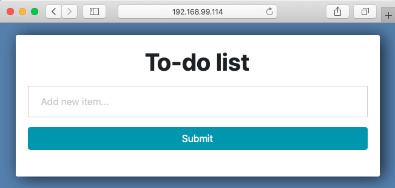

# To-do list
This project will resemble a to-do list where you can track all of the tasks that you need to complete, the user will be
able to create, update and delete tasks in such list. 

This basic application is written in Python, it uses Django web framework and Postgres as the database. 

> ⚠️ _The following instructions describe the process to setup and run the application using various tools in MacOS environmnent._ 

## Django
Django runs on an Model View Template system:

**Model**: Sets out the schema for our database. With Django’s ORM, you can declare the fields, field types, etc. 

**View**: Set all of your code logic and algorithms, you can get results from the database or manipulate some data, it basically 
expects a request and a response. 

**Template**: Plain HTML code with Django's Template Language in it.

**Settings**: Holds all the settings of your web app.

**Url**: It helps to connect the view to a url.

**Admin**: Deals with how you want to view your models in the django admin.

## Setup local environment 
Assuming you have ``brew`` installed you can install postgres, optionally you can download it from their site: https://www.postgresql.org/download/
```
$ brew install postgresql
$ brew services start postgresql
```
Create user for the application and give permission to create db (as this will be used for the unit tests) : 
```
$ psql postgres
postgres=# CREATE USER todouser WITH PASSWORD 'supersecretpassword' CREATEDB;
CREATE ROLE
postgres=# GRANT ALL ON ALL TABLES IN SCHEMA public to todouser;
GRANT
postgres=# GRANT ALL ON ALL SEQUENCES IN SCHEMA public to todouser;
GRANT
postgres=# GRANT ALL ON ALL FUNCTIONS IN SCHEMA public to todouser;
GRANT
```

Install python3: 
```
$ brew install python@3.7
$ echo 'export PATH="/usr/local/opt/python@3.7/bin:$PATH"' >> ~/.zshrc
$ export LDFLAGS="-L/usr/local/opt/python@3.7/lib"
$ export PKG_CONFIG_PATH="/usr/local/opt/python@3.7/lib/pkgconfig"
$ source ~/.zshrc
$ python3 --version
Python 3.7.9
```
Create and activate the virtual environment: 
```
$ python3 -m venv venv
$ source venv/bin/activate
```
Install the requirements and create the necessary tables in the database: 
```
$ pip install -r requirements.txt 
$ export HOST=localhost
$ python manage.py migrate
```

Run the application: 
```
$ python manage.py runserver 
Watching for file changes with StatReloader
Performing system checks...

System check identified no issues (0 silenced).
October 23, 2020 - 01:16:02
Django version 3.0.3, using settings 'todoproject.settings'
Starting development server at http://127.0.0.1:8000/
Quit the server with CONTROL-C.
```
### Run unit tests

Unit test can be found in [todoapp/tests.py](todoapp/tests.py), to run them execute the following commands: 

```
 $ export HOST=localhost 
 $ python manage.py test
```

The output should be **_OK_** and something like: 
```
Creating test database for alias 'default'...
System check identified no issues (0 silenced).
......
----------------------------------------------------------------------
Ran 6 tests in 0.312s

OK
Destroying test database for alias 'default'...
```

## CI/CD
**GitHub Actions** is a continuous integration that makes it easy to automate all your software workflows. 
It builds, test and deploys code right from GitHub.

> ℹ️  I had used Travis CI but after a few issues with the provisioning of builds out of knowhere
> I decided to change to GitHub Actions

**Heroku** is a cloud platform that lets you build, deliver, monitor and scale applications. For this app, Heroku
was configure to deploy the application after a merge to master from a PR. 

For this project, the workflows are described in [.github/workflows](.github/workflows), there are two different types:
* Run unit tests: will only run only on Pull Requests and when a merge to master happens
* Deploy to Heroku: will be trigger only when there's a merge to master 

The application can be found in https://todolist-dsti-devops.herokuapp.com/  (it might take a bit to load 😉)

Some commands useful for debugging in Heroku: 
* `heroku run bash -a todolist-dsti-devops` 
* `psql $DATABASE_URL`

## Infrastructure as Code
**Vagrant** is a tool for building and maintaining portable virtual software development environments, it 
also has integration with **Ansible** as a provisioner for these virtual machines. 

To run the application make sure you have [Virtualbox][https://www.virtualbox.org/wiki/Downloads] and [Vagrant](https://www.vagrantup.com/downloads.html)
 already  installed and `cd` into the root directory of the project: 
```
$ vagrant up
```
⏳ Wait for it to provision 
> ⚠️  If you have the following error: "_Permission denied (publickey). fatal: Could not read from remote repository._" 
> make sure you have added the correct key linked the repository were you have access:  `ssh-add ~/.ssh/your_key`

The app will be running on: http://20.20.20.2:8000/ and http://localhost:8080/
this is because we have the following lines in the [Vagrantfile](Vagrantfile): 
```
server.vm.network :private_network, ip: "20.20.20.2"
server.vm.network "forwarded_port", guest: 8000, host: 8080, host_ip: "127.0.0.1"
```
* **private_network** allows to access the guest machine with a private address **20.20.20.2:8080**
* **forwarded_port** will allow accessing port **8000** on the guest via port **8080** on the host.

For the cleanup run: 
```
$ vagrant destroy
```

## Dockerizing the application

* [Dockerfile](Dockerfile) builds an image based on a Python image on Docker Hub, copies the code for the 
application and installs requierements. 

* [.dockerignore](.dockerignore)  excludes files and directories that match patterns in it.

* [docker-compose.yml](docker-compose.yml) describes the services that makes the application and the ports in which
the services will be exposed, in this case I have the **django web application** exposed on port **8000** and the
 postgres db exposed on port **5432**.

The image for the dockerfile can be found in **[DockerHub](https://hub.docker.com/repository/docker/patrondiana13/todolist-dsti-devops)** 
and can be downloaded via: `docker pull patrondiana13/todolist-dsti-devops`

To run the application make sure you have [Docker](https://docs.docker.com/docker-for-mac/install/) installed, 
go to the root directory of the project and execute the following command: 
```
$ docker-compose up
web_1  | Watching for file changes with StatReloader
web_1  | Performing system checks...
web_1  | 
web_1  | System check identified no issues (0 silenced).
web_1  | October 23, 2020 - 03:43:42
web_1  | Django version 3.1.2, using settings 'todoproject.settings'
web_1  | Starting development server at http://0.0.0.0:8000/
web_1  | Quit the server with CONTROL-C.


```

> ℹ️  `depends_on` in the docker-compose file does not wait for db to be "ready" before starting web - only until it's running

After that you can go to http://0.0.0.0:8000/ to test the application

For the cleanup run: 
```
$ docker-compose down
```


## Kubernetes with Minikube
**Kubernetes** aims to provide a platform for automating deployment, scaling, and operations of application containers 
across clusters of hosts. It works with a range of container tools, including Docker.

**Minikube** is a tool that lets you run Kubernetes locally. Minikube runs a single-node Kubernetes cluster on your personal computer

To get started execute the following commands, make sure you are on the root directory of the project and have 
(minikube)[https://minikube.sigs.k8s.io/docs/start/] installed: 
````
$ minikube start --vm-driver=virtualbox
$ minikube dashboard
minikube status
minikube
type: Control Plane
host: Running
kubelet: Running
apiserver: Running
kubeconfig: Configured
$ kubectl apply -f k8s/postgres
$ kubectl apply -f k8s/webapp
$ kubectl get services
NAME               TYPE        CLUSTER-IP    EXTERNAL-IP   PORT(S)          AGE
django-service     NodePort    10.108.46.7   <none>        8000:32589/TCP   5s
kubernetes         ClusterIP   10.96.0.1     <none>        443/TCP          3m5s
postgres-service   NodePort    10.99.5.131   <none>        5432:30877/TCP   11s
$ kubectl get pods               
NAME                                   READY   STATUS    RESTARTS   AGE
django-79995b5db9-4ncmw                1/1     Running   2          63s
postgres-deployment-84d6bf49c8-4mvcp   1/1     Running   0          71s
$ minikube service django-service
|-----------|----------------|-------------|-----------------------------|
| NAMESPACE |      NAME      | TARGET PORT |             URL             |
|-----------|----------------|-------------|-----------------------------|
| default   | django-service |        8000 | http://192.168.99.100:30934 |
|-----------|----------------|-------------|-----------------------------|
🎉  Opening service default/django-service in default browser...
````
The last command will open a browser with the application running.

For the cleanup: 
```
$ kubectl delete -f k8s/postgres
$ kubectl delete -f k8s/webapp
$ minikube delete
```

## Service mesh using Istio
**Istio** addresses the challenges developers and operators face as monolithic applications transition towards a 
distributed microservice architecture. It makes it easy to create a network of deployed services with load balancing, 
service-to-service authentication, monitoring, and more, with few or no code changes in service code.
```
$ minikube start --vm-driver=virtualbox
$ curl -L https://istio.io/downloadIstio | sh -
$ cd istio-1.7.3
$ export PATH=$PWD/bin:$PATH
```

Return to the root directory of the project and deploy: 
``` 
$ cd ..
$ istioctl install --set profile=demo
$ kubectl label namespace default istio-injection=enabled
$ kubectl apply -f istio/postgres
$ kubectl apply -f istio/webapp 
```
Make sure there are no issues with the configuration: 
```
$ istioctl analyze 
✔ No validation issues found when analyzing namespace: default.
```

To know in which host is your application running to the following: 
```
$ minikube service todolist
|-----------|----------|-------------|-----------------------------|
| NAMESPACE |   NAME   | TARGET PORT |             URL             |
|-----------|----------|-------------|-----------------------------|
| default   | todolist | http/8000   | http://192.168.99.114:31018 |
|-----------|----------|-------------|-----------------------------|
🎉  Opening service default/todolist in default browser...

```

This will open a browser with one of the two versions of the app: 

v1            |  v2
:-------------------------:|:-------------------------:
  |  

> ℹ️  When routing to different versions of the application I had to force refresh without cache in chrome, use 
> **Command** + **Shift** + **R**  if you are using a Mac; optionally you can open another browser. 

Istio can integrate with telemetry application to gain an understanding of the structure of the service mesh, 
display the topology and analyze the health of the mesh, following up we will deploy Kiali dashboard

```
$ kubectl apply -f istio-1.7.3/samples/addons
$ while ! kubectl wait --for=condition=available --timeout=600s deployment/kiali -n istio-system; do sleep 1; done
```

> ❗ If there are errors trying to install the addons, try running the command again. There may be some timing 
> issues which will be resolved when the command is run again.

Access the Kiali dashboard
```
$ istioctl dashboard kiali
```


For the cleanup: 
```
$ kubectl delete -f istio/webapp
$ kubectl delete -f istio/postgres
$ minikube delete
```